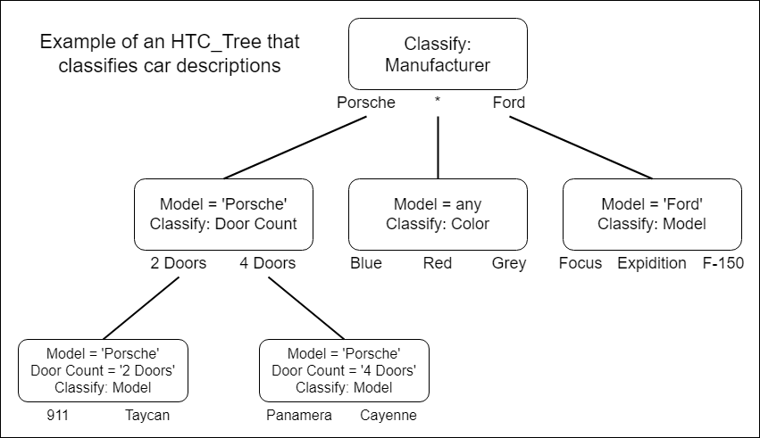
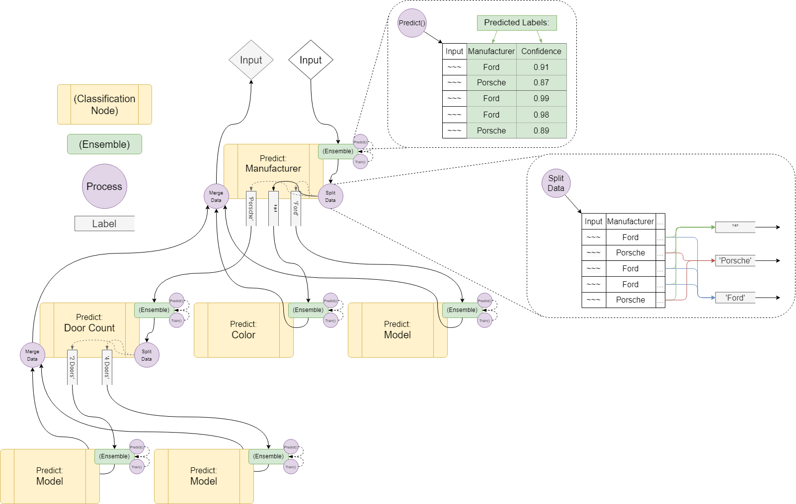

# HTC_Tree
Hierarchical Text Classification (or HTC) represents classification of text along a hierarchy, with subsequent classifications selectively applied based on previous classifications.
This repo contains a structure that represents the hierarchy of such classifications.

### Example Structure: Classifying Porsche and Ford car descriptions
This is a tree with each node representing a single classification and subsequent branches representing further classifications based on the outputs of the current node.


<br>This diagram is an example of HTC_Tree structure that would predict Ford and Porsche car models and the color of the car (and for Porsches, the number of doors).
<br>This design would assume that, for whatever reason, Porsche models are 'easier' to predict if its first subdivided into the number of doors.

## Installation
This package is published to [pypi.org](https://pypi.org/project/htc-tree/).
<br>It can be install via pip using:
```
pip install htc_tree
```

## Building a Tree
To build an HTC_Tree structure we use Design Files

### Design Files
Design Files are Json files that dictate the structure and ensembles withing an HTC_Tree.
<br>You use a Json in the below format to describe the structure of the tree, dictate the relevant columns, and provide an emsemble for each node.
<br><br>On structure creation, each ensemble is assigned a random ID (unless one is provided in the Design File) and uses this to (if save_ensembles is True) save a copy of the ensemble at the given path.
<br>When a Design File is generated by calling gernate_design(), the resulting file contains the Ensembles' IDs as well as the path to the already saved Ensembles.
Meaning, when it saved the Ensembles they will be saved in the same place.

### Design File Example: Porsche and Ford classification structure
```JSON
{
    "root": {
        "ensemble path": "<path to pickled Ensemble()>",
        "input column": "Car Descriptions",
        "prediction title": "Manufacturer",
        "branches": {
            "*": [ 
                {
                    "ensemble path": "<path to pickled Ensemble()>",
                    "input column": "Car Descriptions",
                    "prediction title": "Color",
                    "branches": {}
                }
            ],
            "Porsche": [
                {
                    "ensemble path": "<path to pickled Ensemble()>",
                    "input column": "Car Descriptions",
                    "prediction title": "Door Count",
                    "branches": {
                        "2 Doors": [
                            {
                                "ensemble path": "<path to pickled Ensemble()>",
                                "input column": "Car Descriptions",
                                "prediction title": "Model",
                                "branches": {}
                            }
                        ],
                        "4 Doors": [
                            {
                                "ensemble path": "<path to pickled Ensemble()>",
                                "input column": "Car Descriptions",
                                "prediction title": "Model",
                                "branches": {}
                            }
                        ]
                    }
                }
            ],
            "Ford": [
                {
                    "ensemble path": "<path to pickled Ensemble()>",
                    "input column": "Car Descriptions",
                    "prediction title": "Model",
                    "branches": {}
                }
            ]
        }
    },
    "parameters": {
        "verbose": true,
        "save_ensembles": true
    }    
}

```
This design file would be used on first creation of this tree. Since the above design file doesn't contain IDs for the nodes, a new structure would be created each time it is used to build. You could manually reuse nodes from another structure by providing a path to them in the "ensemble path" field but this would still create a 'new' node with a new ID, it would just be a copy of the given node.

<br>The resulting structure can be used to generate a new design file that contains more info on each node. This generated new design file would then be used on subsiquent builds to load the structure. 
<br>To generate this 'Used' design file:
```python
design_dict = root_node.gernate_design()
import json
with open("Design File.json", "w") as file:
    json.dump(design_dict, file, indent=4)
``` 
This could file then be used with:
```
root_node = ClassificationNode.build_from_json(file_path="Design File.json")
```
to rebuild the saved structure.

## Training a Tree
Training is handled recursively within the ClassificationNode class.
<br>For descriptions of how this opperates see code. (I'll add better documentation in the future)
<br>Data is split along the hierarchy during both training and prediction opperations, below is a diagram of how this is done.
### Data Flow Example: Porsche and Ford Train/Predict methods



## Visualizing a Tree

