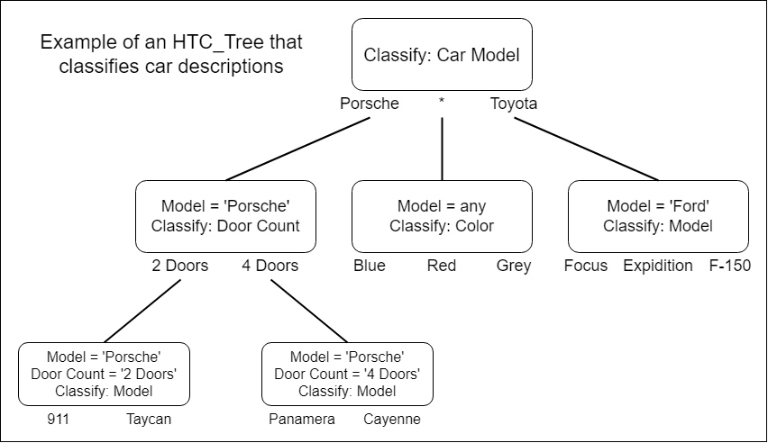

# HTC_Tree
Hierarchical Text Classification (or HTC) represents classification of text along a hierarchy, with subsequent classifications selectively applied based on previous classifications.
This repo contains a structure that represents the hierarchy of such classifications.

This is a tree with each node representing a single classification and subsequent branches representing further classifications based on the outputs of the current node.

 This diagram is an example of HTC_Tree structure that would predict Ford and Porsche car models and the color of the car (and for Porsches, the number of doors).
 This design would assume that, for whatever reason, Porsche models are 'easier' to predict if its first subdivided into the number of doors.

## Building a Tree

### Design JSONs

## Visualizing a Tree

